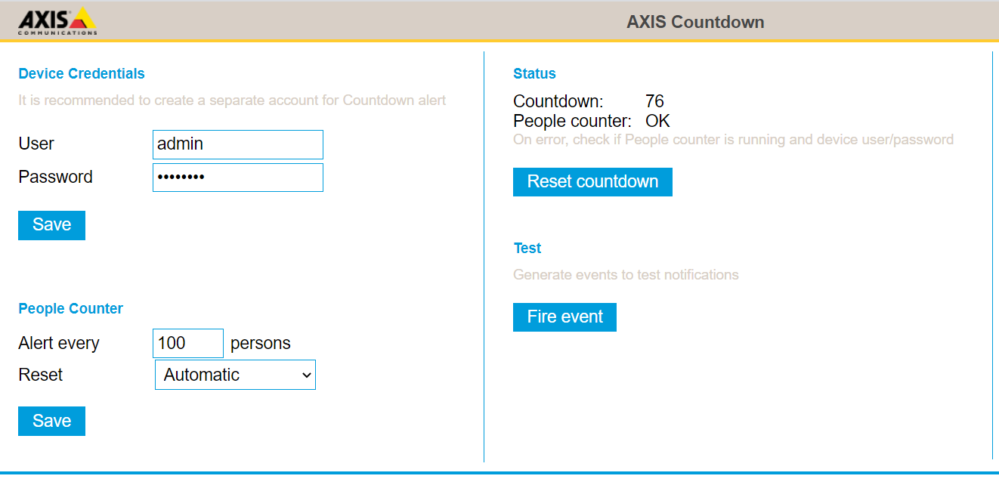

# Countdown
Generates an event when X amount of people passed the camera.  Typically used for sending a notification to alert cleaning personell or similar.

## Prerequisites
1. Axis Camera
2. AXIS People Counter, Axis Occupancy or AXIS Direction Detection

## Supported platforms
- [MIPS](https://github.com/aintegration/acaps/raw/master/Countdown/files/Axis_Countdown_1_0_1_mipsisa32r2el.eap)
- [ARMv7](https://github.com/aintegration/acaps/raw/master/Countdown/files/Axis_Countdown_1_0_1_armv7hf.eap)
- [AARCH64](https://github.com/aintegration/acaps/raw/master/Countdown/files/Axis_Countdown_1_0_1_aarch64.eap)

# Configuration



## Device Credentials
Set user and password for an exisitng administration account in the camera.  The application needs this to monitor the AXIS counter ACAP.  It is recommended to create a new account in the camera so it will continue to work if anyone changes the password of a shared account.

## People Counter
### Alert every...
Set the amount of persons than needs to pass before an event is fired.

### Reset
By default (Automatic) the application will reset the countdown.  If you want the application to only reset on a digital IO or by a HTTP request, set value to Manual.

If the cameras has a digitial IO port you can connect a a button for peronell to press to reset countdown.  The application will reset the countdown when any IO port is high.

API for manual HTTP reset
```
  http://address/local/countdown/reset
```

## Status
Shows the current status of the countdown.  If the "People Counter" dispalys Error, check that the AXIS counter ACAP is running and that you have correct account user and password.

Click "Reset Counter" to manually reset countdown.

## Test
The "Fire event" button will generate an event.  This can be used to test your notifications or action-rules without waiting for the countdown to reach zero.

# Notification / Action
Use the cameras Event [ System | Events] to configure some action.  Create a new action by pressing '+', select "Countdown Reset" in the field "Condition".

