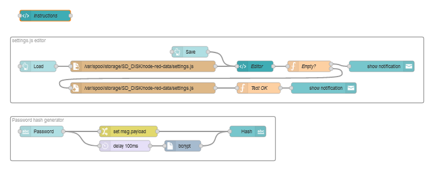
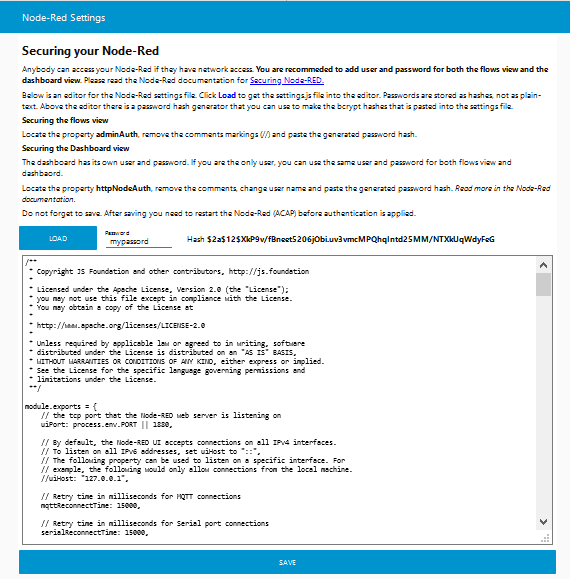

# Securing Node-Red
Anybody can access your Node-Red if they have network access. You are recommeded to add user and password for both the flows view and the dashboard view. Please read the Node-Red documentation for [Securing Node-RED](https://nodered.org/docs/user-guide/runtime/securing-node-red#editor--admin-api-security).

The example flow provides a dashboard editor that can be used to generate password hash and edit the Node-Red settings file.

### Additional nodes to be installed
* [node-red-dashbaord](https://flows.nodered.org/node/node-red-dashboard) User interface dashboard
* [node-red-contrib-bcrypt](https://flows.nodered.org/node/node-red-contrib-bcrypt) Needed to generate password hash

### Example flows snapshot


### Dashboard snapshot


### Flows to be imported into your Node-Red
Copy the following data and import into your Node-Red (Menu | Import )
```
[{"id":"d6f274f9.3fd7e8","type":"tab","label":"Node-Red Settings","disabled":false,"info":""},{"id":"44c14e98.f2967","type":"group","z":"d6f274f9.3fd7e8","name":"Password hash generator","style":{"label":true},"nodes":["20e98ef1.ed966a","27f57f88.292b1","89ab1c4c.ecb4d","631df3fd.a62abc","dc7c3725.2ca6f8"],"x":34,"y":359,"w":732,"h":122},{"id":"6f8bfc5b.4f1594","type":"group","z":"d6f274f9.3fd7e8","name":"settings.js editor","style":{"label":true},"nodes":["fce02e73.bc931","a42eb0ed.bfbfb","46ec372a.77c03","be65d699.3f8958","88d96f92.9d0e6","37b20835.20d25","acf46d98.dafe6","e633af69.9c6718","27d0250e.8ca0ca"],"x":34,"y":139,"w":1132,"h":182},{"id":"fce02e73.bc931","type":"file in","z":"d6f274f9.3fd7e8","g":"6f8bfc5b.4f1594","name":"","filename":"/var/spool/storage/SD_DISK/node-red-data/settings.js","format":"utf8","chunk":false,"sendError":false,"encoding":"none","x":400,"y":220,"wires":[["a42eb0ed.bfbfb"]]},{"id":"20e98ef1.ed966a","type":"bcrypt","z":"d6f274f9.3fd7e8","g":"44c14e98.f2967","name":"","action":"encrypt","field":"payload","hash":"payload","rounds":"8","x":510,"y":440,"wires":[["89ab1c4c.ecb4d"]]},{"id":"a42eb0ed.bfbfb","type":"ui_template","z":"d6f274f9.3fd7e8","g":"6f8bfc5b.4f1594","group":"97506e4a.652a","name":"Editor","order":5,"width":"20","height":"11","format":"<style>\ntextarea {\n  font-family:Consolas,Monaco,Lucida Console,Liberation Mono,DejaVu Sans Mono,Bitstream Vera Sans Mono,Courier New, monospace;\n}    \n</style>\n\n<textarea id=\"{{'settings_'+$id}}\" rows=\"30\" cols=\"80\"></textarea>\n\n<script>\n(function(scope) {\n    scope.$watch('msg', function(msg) {\n        if (!msg || !msg.hasOwnProperty(\"topic\") )\n            return;\n        console.log(msg.topic);\n        if( msg.topic === \"load\") {\n            $(\"#settings_\"+scope.$id).val(msg.payload);\n            return;\n        }\n        if( msg.topic === \"save\") {\n            scope.send({\n                payload:  $(\"#settings_\"+scope.$id).val()\n            });\n            return;\n        }\n    });\n})(scope);\n</script>","storeOutMessages":true,"fwdInMessages":false,"resendOnRefresh":true,"templateScope":"local","x":710,"y":220,"wires":[["88d96f92.9d0e6"]]},{"id":"46ec372a.77c03","type":"ui_button","z":"d6f274f9.3fd7e8","g":"6f8bfc5b.4f1594","name":"","group":"97506e4a.652a","order":2,"width":"3","height":"1","passthru":false,"label":"Load","tooltip":"","color":"","bgcolor":"","icon":"","payload":"","payloadType":"str","topic":"load","x":110,"y":220,"wires":[["fce02e73.bc931"]]},{"id":"27f57f88.292b1","type":"ui_text_input","z":"d6f274f9.3fd7e8","g":"44c14e98.f2967","name":"","label":"Password","tooltip":"","group":"97506e4a.652a","order":3,"width":"3","height":"1","passthru":false,"mode":"text","delay":"0","topic":"","x":120,"y":400,"wires":[["dc7c3725.2ca6f8","631df3fd.a62abc"]]},{"id":"89ab1c4c.ecb4d","type":"ui_text","z":"d6f274f9.3fd7e8","g":"44c14e98.f2967","group":"97506e4a.652a","order":4,"width":"14","height":"1","name":"","label":"Hash","format":"{{msg.payload}}","layout":"row-left","x":690,"y":400,"wires":[]},{"id":"be65d699.3f8958","type":"ui_button","z":"d6f274f9.3fd7e8","g":"6f8bfc5b.4f1594","name":"","group":"97506e4a.652a","order":6,"width":0,"height":0,"passthru":false,"label":"Save","tooltip":"","color":"","bgcolor":"","icon":"","payload":"","payloadType":"str","topic":"save","x":530,"y":180,"wires":[["a42eb0ed.bfbfb"]]},{"id":"631df3fd.a62abc","type":"change","z":"d6f274f9.3fd7e8","g":"44c14e98.f2967","name":"","rules":[{"t":"set","p":"payload","pt":"msg","to":"Wait...","tot":"str"}],"action":"","property":"","from":"","to":"","reg":false,"x":360,"y":400,"wires":[["89ab1c4c.ecb4d"]]},{"id":"88d96f92.9d0e6","type":"function","z":"d6f274f9.3fd7e8","g":"6f8bfc5b.4f1594","name":"Empty?","func":"if( msg.payload.length > 9000 ) {\n    node.send([\n        null,\n        msg\n    ])\n    return;\n}\n\nnode.send([\n    {\n        payload:\"Not saved.  The size indicates faulty settings file.\"\n    },\n    null\n])\nreturn msg;","outputs":2,"noerr":0,"initialize":"","finalize":"","x":860,"y":220,"wires":[["37b20835.20d25"],["acf46d98.dafe6"]]},{"id":"dc7c3725.2ca6f8","type":"delay","z":"d6f274f9.3fd7e8","g":"44c14e98.f2967","name":"","pauseType":"delay","timeout":"100","timeoutUnits":"milliseconds","rate":"1","nbRateUnits":"1","rateUnits":"second","randomFirst":"1","randomLast":"5","randomUnits":"seconds","drop":false,"x":350,"y":440,"wires":[["20e98ef1.ed966a"]]},{"id":"37b20835.20d25","type":"ui_toast","z":"d6f274f9.3fd7e8","g":"6f8bfc5b.4f1594","position":"top right","displayTime":"3","highlight":"red","sendall":true,"outputs":0,"ok":"OK","cancel":"","raw":false,"topic":"","name":"","x":1060,"y":220,"wires":[]},{"id":"acf46d98.dafe6","type":"file","z":"d6f274f9.3fd7e8","g":"6f8bfc5b.4f1594","name":"","filename":"/var/spool/storage/SD_DISK/node-red-data/settings.js","appendNewline":false,"createDir":false,"overwriteFile":"true","encoding":"none","x":400,"y":280,"wires":[["27d0250e.8ca0ca"]]},{"id":"e633af69.9c6718","type":"ui_toast","z":"d6f274f9.3fd7e8","g":"6f8bfc5b.4f1594","position":"top right","displayTime":"3","highlight":"green","sendall":true,"outputs":0,"ok":"OK","cancel":"","raw":false,"topic":"","name":"","x":900,"y":280,"wires":[]},{"id":"27d0250e.8ca0ca","type":"function","z":"d6f274f9.3fd7e8","g":"6f8bfc5b.4f1594","name":"Test OK","func":"//Test TBD\nmsg.payload = \"Settings was saved.\\nYou need to restart Node-Red (ACAP)\";\nreturn msg;","outputs":1,"noerr":0,"initialize":"","finalize":"","x":720,"y":280,"wires":[["e633af69.9c6718"]]},{"id":"c6dee375.0e49d","type":"ui_template","z":"d6f274f9.3fd7e8","group":"97506e4a.652a","name":"Instructions","order":1,"width":"20","height":"7","format":"<h2>Securing your Node-Red</h2>\n<p>Anybody can access your Node-Red if they have network access.  <b>You are recommeded to add user and password for both the flows view and the dashboard view</b>.  \nPlease read the Node-Red documentation for <a target=\"_blank\" href=\"https://nodered.org/docs/user-guide/runtime/securing-node-red#editor--admin-api-security\">Securing Node-RED.</a></p>\n<p> Below is an editor for the Node-Red settings file.  Click <b style=\"color:blue\">Load</b> to get the settings.js file into the editor. Passwords are stored as hashes, not as plain-text.  Above the editor there is a password hash generator that you can use to make the bcrypt hashes that is pasted into the settings file.</p>\n<h4>Securing the flows view</h4>\n<p>Locate the property <b>adminAuth</b>, remove the comments markings (//) and paste the generated password hash.</p>\n<h4>Securing the Dashboard view</h4>\n<p>The dashboard has its own user and password. If you are the only user, you can use the same user and password for both flows view and dashbaord.</p>\n<p>Locate the property <b>httpNodeAuth</b>, remove the comments, change user name and paste the generated password hash. <i>Read more in the Node-Red documentation.</i></p>\n<p>Do not forget to save.  After saving you need to restart the Node-Red (ACAP) before authentication is applied.</p>\n","storeOutMessages":true,"fwdInMessages":true,"resendOnRefresh":true,"templateScope":"local","x":130,"y":80,"wires":[[]]},{"id":"97506e4a.652a","type":"ui_group","name":"Settings","tab":"6ffbef5e.e37a78","order":1,"disp":false,"width":"20","collapse":false},{"id":"6ffbef5e.e37a78","type":"ui_tab","name":"Node-Red Settings","icon":"dashboard","disabled":false,"hidden":false}]
```
