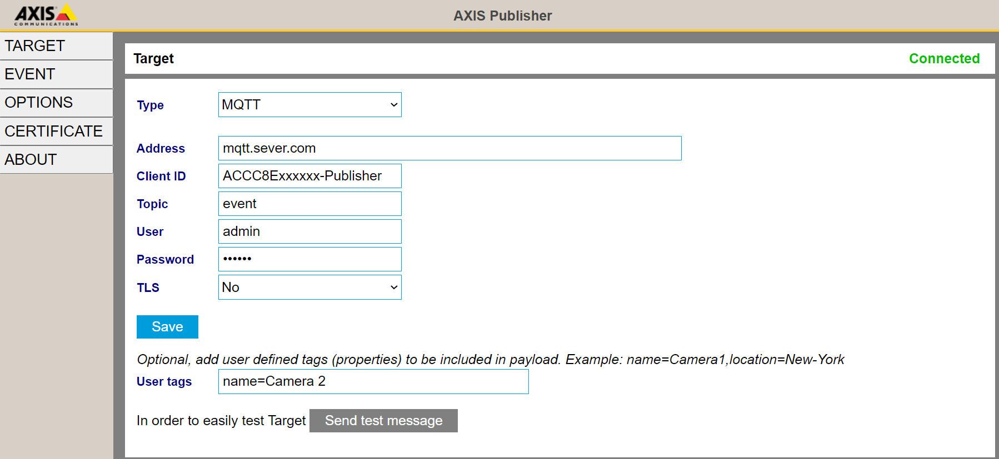
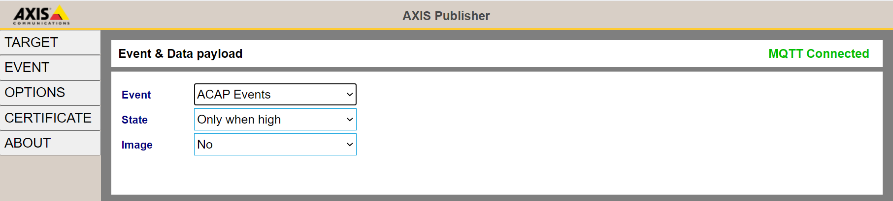

## Prerequisites
1. Axis Camera with firmware 10.X or higher
2. An MQTT Broker, Influx server or HTTP server

## Download
[Change log](https://github.com/aintegration/acaps/blob/master/Publisher/files/changelog.md)

- [MIPS](https://github.com/aintegration/acaps/raw/master/Publisher/files/Axis_Publisher_2_2_5_mips.eap)
- [ARMv7hf](https://github.com/aintegration/acaps/raw/master/Publisher/files/Axis_Publisher_2_2_5_armv7hf.eap)
- [AARCH64](https://github.com/aintegration/acaps/raw/master/Publisher/files/Axis_Publisher_2_2_5_aarch64.eap)

# Configuration

## TARGET
Select Target type MQTT, HTTP or Influx

* Address: HTTP & Influx needs to start with http:// or https://
* User: All	Leave blank if not needed
* Password: Leave blank if not needed
* TLS: Use TLS if server requires. "Trust Server Certificate" will trust all certificates. "Verify certificate" will reject connections if certificate is expired or does not match the address".  If client certificate is required, install that in menu CERTIFICATE
* User tags: User defined tags will be included in payload. Multiple tags may be separated with comma. Example: name=Camera 1,location=New York

### MQTT
* Client ID: Unique MQTT client identifier string
* Topic: The topic that messages will be published on device events. If left blank the ONVIF topic will be used 

### Influx
* Database: The name of the database
* Collection: The collection (table) of the database

## EVENT
Set device event that will trigger data publishing

* Event: Set the event. Some selections (e.g. "ACAP Events") may trigger publishing on multiple events.  Subscribers can see which event that triggered.
* State: Select if publishing shall occur when event goes high or on all high/low transitions.
* Image: A JPEG image (base64 encoded) will be included in the payload. Set resolutions and video channel. Channels other than 1 are typically used for cropped images (View Areas).

## OPTIONS
Additional features and options.  See OPTIONS menu for more details.
* Set video text overlay with MQTT
* Recurring device status on MQTT
* MQTT to VMS event proxy
