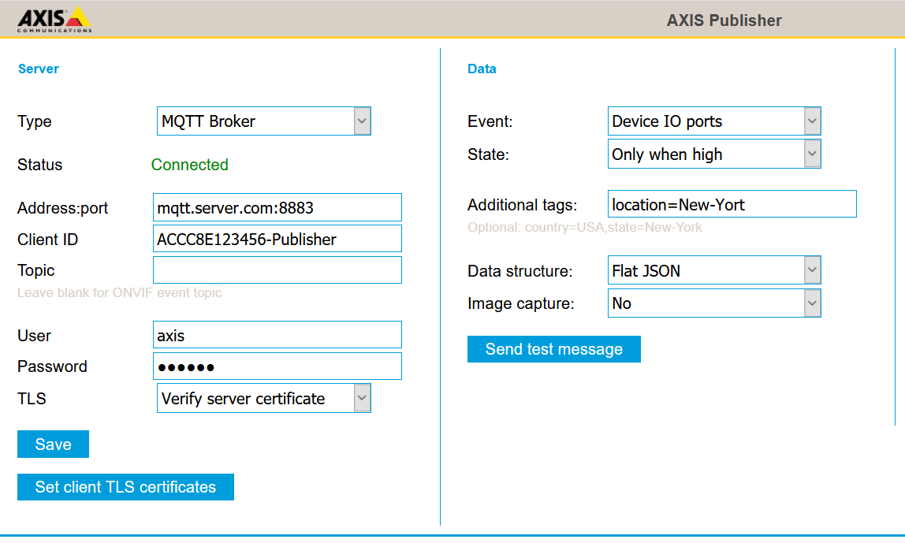

## Prerequisites
1. Axis Camera with firmware 10.X or higher
2. An Influx server, HTTP server or MQTT Broker

## Supported platforms
Version 2.0-2 [Change log](https://github.com/aintegration/acaps/blob/master/Publisher/files/changelog.md)
- [MIPS](https://github.com/aintegration/acaps/raw/master/Publisher/files/Axis_Publisher_mips.eap)
- [ARMv7hf](https://github.com/aintegration/acaps/raw/master/Publisher/files/Axis_Publisher_armv7hf.eap)
- [AARCH64](https://github.com/aintegration/acaps/raw/master/Publisher/files/Axis_Publisher_aarch64.eap)


# Configuration

## Server
### Type
The server type that will receive data.

### Address:port
Examples
```
  mqtt.server.com:1883
  http://12.23.34.45/some/end/point
  influx.server.com:8086
```
### Additional MQTT settings
#### MQTT: Client ID
Set a uniques clinet ID name.
#### MQTT: Topic
Leaving topic blank will result in default **topic axis/event/[DEVICE EVENT TOPIC]**
#### MQTT Device status publish
Axis device status will be automatically published every 15 minutes.  This can be used as monitor devices.
```
Topic: axis/status
Payload: {
{
  "IPv4":"1.2.3.4",
  "firmware":"10.0.2",
  "model":"AXIS M3057-PLVE",
  "serial":"ACCC8E123456",
  "kbps":179.2,
  "loadavg":0.5
}
```
kbps = average outgoing network traffic
loadavg = Linux average CPU load (15 minute average)
#### MQTT Subscription
Axis Publisher automatically subscribes on topics
- axis/[SERIAL NUMBER]/event
- axis/[SERIAL NUMBER]/event/high
- axis/[SERIAL NUMBER]/event/low

Publishing on these topic will generate the following events that can be used to trigger actions in the Axis device or by a Video Management System that monitors the events
- MQTT Event (puls)
- MQTT State (stateful)
If no device or VMS actions are defined, publishing on the topics will have no effect on the device.

### Additional Influx settings
#### Database
Set the database name
#### Collection
Set the collection where data will be stored

### User/Password
Leave blank if broker does not require authentication.

### TLS
Encrypts traffic and verify server authenticity.  If needed, add client certificate by clicking "Set TLS certificates"

## Data
### Event
Select that event that will trigger and set payload.
### State
Some events are stateful (high/low).  Us this to only receive data when the event goes high or reecive messages when if goes either high or low.
### Additional tags
Add additional tags that will be included as properties in payload.
Examples
```
location=New-York
country=France,city=Paris,store=some-id
```
### Image Capture
If setting image, a JPEG image will be included (base64 encoded)

### Test connection
This will publish test data to the target and display a success/failure message.  On failure, check the log for hints.
